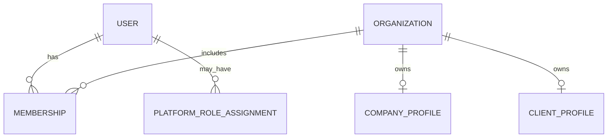
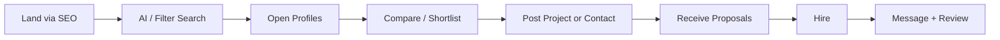
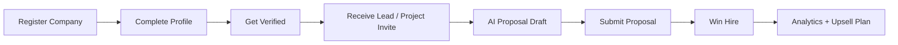

# Phase 2 — User Personas & Permissions Matrix

**Product:** ForgeLink  
**Document:** 02 — Personas & Permissions  
**Version:** 1.0.0  

---

## 1. Role Model Overview

ForgeLink uses a hybrid identity model:

- A **User** authenticates once
- A User may hold one or more **Memberships** in **Organizations** (companies/agencies)
- Platform staff roles (`moderator`, `super_admin`) are assigned at the platform level
- Client buyers may act as individuals or as members of a **Client Organization**

### Canonical Roles

| Role Key | Scope | Description |
|----------|-------|-------------|
| `guest` | Public | Unauthenticated visitor |
| `client` | User / Client Org | Buyer seeking agencies |
| `agency_member` | Company Org | Staff of a listed company |
| `agency_owner` | Company Org | Primary company admin |
| `freelancer` | User | Solo provider (Phase 2 primary) |
| `company_admin` | Platform | Ops staff managing verifications |
| `moderator` | Platform | Content & trust moderation |
| `super_admin` | Platform | Full system control |

> Note: `company_admin` here means **platform operations admin** (internal), not the agency’s own admin (`agency_owner`).

---

## 2. User Personas

### 2.1 Client — “Priya, Product-Led Founder”

| Attribute | Detail |
|-----------|--------|
| Title | Founder / Head of Product |
| Company | Seed-stage SaaS, 8–40 employees |
| Geography | US / UAE / UK / India |
| Goals | Find a reliable product engineering partner in 1–2 weeks |
| Frustrations | Opaque rankings, slow RFPs, agencies overselling |
| Behaviors | Searches by tech stack + budget; reads 3–5 reviews; compares 3 agencies |
| Success | Shortlist in one session; 2+ quality proposals in 72h |
| Tools | Slack, Notion, Figma, Stripe |
| Quote | “I don’t want 50 pitches. I want 3 that actually fit.” |

**Jobs to be done**
- Describe project in plain language
- Discover agencies matching stack/budget/timezone
- Validate trust via reviews & case studies
- Invite shortlist or open project for proposals
- Hire and communicate in one place

**Key screens**
- Home / AI Search, Company Profile, Compare, Post Project, Inbox, Dashboard

---

### 2.2 Agency — “Marco, Growth Lead at a Digital Agency”

| Attribute | Detail |
|-----------|--------|
| Title | Head of Growth / Partnerships |
| Company | 25–120 person digital / software agency |
| Geography | Eastern Europe / LATAM / SEA |
| Goals | Qualified inbound leads; improve conversion from profile views |
| Frustrations | Spam leads; incomplete analytics; content writing burden |
| Behaviors | Updates portfolio monthly; responds to leads same day; buys Professional plan |
| Success | ≥ 8 qualified leads/month; profile completeness 90%+ |
| Quote | “Show me buyers who match our ICP — not tire-kickers.” |

**Jobs to be done**
- Publish rich profile & case studies
- Receive & score leads
- Submit proposals quickly (AI-assisted)
- Track visibility & conversion analytics
- Upgrade for featured placement when ROI is clear

---

### 2.3 Freelancer — “Aisha, Senior Full-Stack Freelancer”

| Attribute | Detail |
|-----------|--------|
| Title | Independent contractor / boutique collective lead |
| Goals | Win mid-size projects without competing only on price |
| Frustrations | Platforms biased to race-to-bottom; weak brand page |
| Behaviors | Maintains niche tech keywords; selective bidding |
| Success | 1–2 solid projects/quarter via ForgeLink |
| Phase | **Phase 2** full support; MVP may register as micro-company |

---

### 2.4 Company Admin (Platform Ops) — “Elena, Verification Specialist”

| Attribute | Detail |
|-----------|--------|
| Title | Trust & Safety / Company Ops |
| Goals | Verify legitimate companies; reject fakes; keep directory quality high |
| Frustrations | Incomplete docs; duplicate companies; brand impersonation |
| Behaviors | Reviews queues daily; uses checklist + risk signals |
| Success | Verification SLA ≤ 48 business hours; false-positive rejects < 2% |

---

### 2.5 Moderator — “Jordan, Trust Moderator”

| Attribute | Detail |
|-----------|--------|
| Title | Content & Community Moderator |
| Goals | Remove abuse, spam projects, fake reviews; fair dispute handling |
| Behaviors | Triage reports by severity; escalate legal threats |
| Success | Report triage p50 ≤ 4h; clear audit trail on every action |

---

### 2.6 Super Admin — “Sam, Platform Owner”

| Attribute | Detail |
|-----------|--------|
| Title | Head of Platform / Eng Ops |
| Goals | Configure plans, SEO, feature flags, billing, roles |
| Behaviors | Uses admin dashboards, revenue reports, system health |
| Success | Zero unauthorized privilege escalations; predictable releases |

---

## 3. Persona Journey Snapshots

### Client Happy Path

### Agency Happy Path

---

## 4. Permissions Matrix

Legend: **C** = Create, **R** = Read, **U** = Update, **D** = Delete, **M** = Moderate, **—** = None, **Own** = own resources only, **Org** = organization scope, **All** = platform-wide

### 4.1 Identity & Account

| Permission | Guest | Client | Agency Member | Agency Owner | Freelancer | Company Admin | Moderator | Super Admin |
|------------|-------|--------|---------------|--------------|------------|---------------|-----------|-------------|
| Register / Login | C | — | — | — | — | — | — | All |
| Manage own profile | — | RU | RU | RU | RU | RU | RU | RU |
| Enable 2FA | — | CU | CU | CU | CU | CU | CU | CU |
| Delete own account | — | D | D* | D* | D | — | — | All |
| Impersonate user (audit) | — | — | — | — | — | — | — | C |

\* Agency deletion blocked if sole owner of active paid org — must transfer ownership first.

### 4.2 Company Profiles

| Permission | Guest | Client | Agency Member | Agency Owner | Freelancer | Company Admin | Moderator | Super Admin |
|------------|-------|--------|---------------|--------------|------------|---------------|-----------|-------------|
| View public profile | R | R | R | R | R | R | R | R |
| Create company | — | C† | — | C | C† | C | — | C |
| Edit company profile | — | — | U Org‡ | U Org | U Own | U All | U limited | U All |
| Manage portfolio / case studies | — | — | CUD Org‡ | CUD Org | CUD Own | M | M | All |
| Submit verification | — | — | — | C Org | C Own | R | R | All |
| Approve / reject verification | — | — | — | — | — | M | — | M |
| Feature / boost listing | — | — | — | C Org | C Own | — | — | All |
| Soft-delete company | — | — | — | D Org | D Own | D | D | All |

† Client creating a company converts/adds supplier org membership.  
‡ Agency Member permissions configurable by Owner (default: edit content, not billing).

### 4.3 Search & Discovery

| Permission | Guest | Client | Agency Member | Agency Owner | Freelancer | Company Admin | Moderator | Super Admin |
|------------|-------|--------|---------------|--------------|------------|---------------|-----------|-------------|
| Keyword / AI search | R | R | R | R | R | R | R | R |
| Use advanced filters | R | R | R | R | R | R | R | R |
| Save searches | — | CUD Own | CUD Own | CUD Own | CUD Own | — | — | All |
| Compare companies | R§ | CUD | CUD | CUD | CUD | — | — | All |
| View ranking explanation | R | R | R | R | R | R | R | R |

§ Guest compare limited to session (max 3); login to persist.

### 4.4 Projects & Proposals

| Permission | Guest | Client | Agency Member | Agency Owner | Freelancer | Company Admin | Moderator | Super Admin |
|------------|-------|--------|---------------|--------------|------------|---------------|-----------|-------------|
| Post project | — | C | — | — | — | — | — | All |
| Edit own project | — | U Own | — | — | — | — | M | All |
| View open projects (marketplace) | — | R¶ | R | R | R | R | R | R |
| Submit proposal | — | — | C Org | C Org | C Own | — | — | — |
| Compare proposals | — | R Own | — | — | — | — | — | All |
| Hire / reject / shortlist | — | U Own | — | — | — | — | — | All |
| Moderate / remove project | — | — | — | — | — | — | M | M |
| Attach NDA | — | C Own | R if invited | R if invited | R if invited | R | R | All |

¶ Private projects visible only to invited companies + owner.

### 4.5 Messaging

| Permission | Guest | Client | Agency Member | Agency Owner | Freelancer | Company Admin | Moderator | Super Admin |
|------------|-------|--------|---------------|--------------|------------|---------------|-----------|-------------|
| Start conversation | — | C | C Org | C Org | C | — | — | All |
| Send messages / files | — | C Own | C Org | C Org | C Own | — | — | All |
| Read receipts / typing | — | R Own | R Org | R Org | R Own | — | — | All |
| Report conversation | — | C | C | C | C | R | M | M |
| View message for abuse | — | — | — | — | — | — | R flagged | All |

### 4.6 Reviews

| Permission | Guest | Client | Agency Member | Agency Owner | Freelancer | Company Admin | Moderator | Super Admin |
|------------|-------|--------|---------------|--------------|------------|---------------|-----------|-------------|
| Read reviews | R | R | R | R | R | R | R | R |
| Submit review | — | C# | — | — | — | — | — | — |
| Mark helpful | — | C | C | C | C | — | — | All |
| Company reply | — | — | C Org‡ | C Org | C Own | — | — | All |
| Report abuse | — | C | C | C | C | R | M | M |
| Moderate reviews | — | — | — | — | — | — | M | M |
| View AI review summary | R | R | R | R | R | R | R | R |

# Requires verified engagement (completed hire on platform) OR invite-to-review token from company; unverified reviews labeled and rate-limited.

### 4.7 Subscriptions & Billing

| Permission | Guest | Client | Agency Member | Agency Owner | Freelancer | Company Admin | Moderator | Super Admin |
|------------|-------|--------|---------------|--------------|------------|---------------|-----------|-------------|
| View plans | R | R | R | R | R | R | R | R |
| Subscribe / change plan | — | — | — | CUD Org | CUD Own | — | — | All |
| View invoices | — | R Own** | — | R Org | R Own | — | — | All |
| Apply coupons | — | — | — | C Org | C Own | — | — | All |
| Manage plan catalog | — | — | — | — | — | — | — | CUD |
| Refunds | — | — | — | — | — | — | — | C |

** Clients may have optional premium buyer tools in Future; MVP invoices are supplier-side.

### 4.8 Admin / CMS / SEO

| Permission | Guest | Client | Agency Member | Agency Owner | Freelancer | Company Admin | Moderator | Super Admin |
|------------|-------|--------|---------------|--------------|------------|---------------|-----------|-------------|
| Admin dashboard | — | — | — | — | — | R | R | R |
| User management | — | — | — | — | — | R | R | CUD |
| CMS pages / blog | — | — | — | — | — | — | CU | CUD |
| SEO meta / redirects | — | — | — | — | — | — | U limited | CUD |
| Email templates | — | — | — | — | — | — | R | CUD |
| Feature flags | — | — | — | — | — | — | — | CUD |
| Analytics & revenue | — | — | — | — | — | R limited | R limited | R All |
| Audit logs | — | — | — | — | — | R | R | R |
| System settings | — | — | — | — | — | — | — | CUD |

### 4.9 AI Features Usage

| Permission | Guest | Client | Agency Member | Agency Owner | Freelancer | Notes |
|------------|-------|--------|---------------|--------------|------------|-------|
| AI Smart Search | Limited | Full | Full | Full | Full | Guest: N queries / IP / day |
| AI Company Matching | — | Plan/Free tier | — | — | — | Credits apply |
| AI Proposal Writer | — | — | Credits | Credits | Credits | Org plan limits |
| AI Description Generator | — | — | Credits | Credits | Credits | Human approve |
| AI SEO Meta Generator | — | — | Credits | Credits | Credits | |
| AI FAQ Generator | — | — | Credits | Credits | Credits | |
| AI Blog Writer | — | — | — | Pro+ | Pro+ | Phase 2 |
| AI Review Analysis | R summary | R | R | R | R | Public summary; deep analysis Pro+ |
| AI Lead Scoring | — | — | Pro+ | Pro+ | Pro+ | |

---

## 5. Organization Membership Permissions (Agency Internal)

Agency Owner can assign member roles:

| Org Role | Capabilities |
|----------|--------------|
| `owner` | Full org control including billing & ownership transfer |
| `admin` | Manage profile, team, proposals, leads; no billing cancel |
| `editor` | Edit profile content, portfolio, case studies |
| `sales` | Leads, proposals, messaging; read analytics |
| `viewer` | Read-only dashboard & analytics |

---

## 6. Permission Enforcement Rules

1. **Deny by default** — missing permission = 403
2. **Scope checks** — Own / Org / All evaluated after role check
3. **Plan gates** — feature permission ∩ subscription entitlement
4. **Resource state** — e.g., cannot propose on `closed` / `hired` projects
5. **Verification gates** — unverified companies may have reduced ranking & limited proposal slots
6. **Audit** — all admin/moderator mutations write `audit_logs`
7. **JWT claims** include `roles[]`, `org_ids[]`, `permissions[]` (or permission version hash + Redis lookup)

---

## 7. Account States

| State | Meaning | Access |
|-------|---------|--------|
| `pending_verification` | Email/OTP not confirmed | Auth limited |
| `active` | Normal | Full per role |
| `restricted` | Trust hold | Read + appeal |
| `suspended` | Policy violation | Auth blocked except support |
| `deleted` | Soft-deleted / GDPR erase queued | None |

---

## 8. Acceptance Criteria — Permissions

- [ ] Every API endpoint maps to at least one permission key
- [ ] FE hides unavailable actions; BE still enforces
- [ ] Role changes take effect within 60s (token refresh / session version)
- [ ] Super Admin actions always audited with reason code
- [ ] Ownership transfer requires password/2FA confirmation

---

*Next: [03 — Information Architecture](./03-information-architecture.md)*
