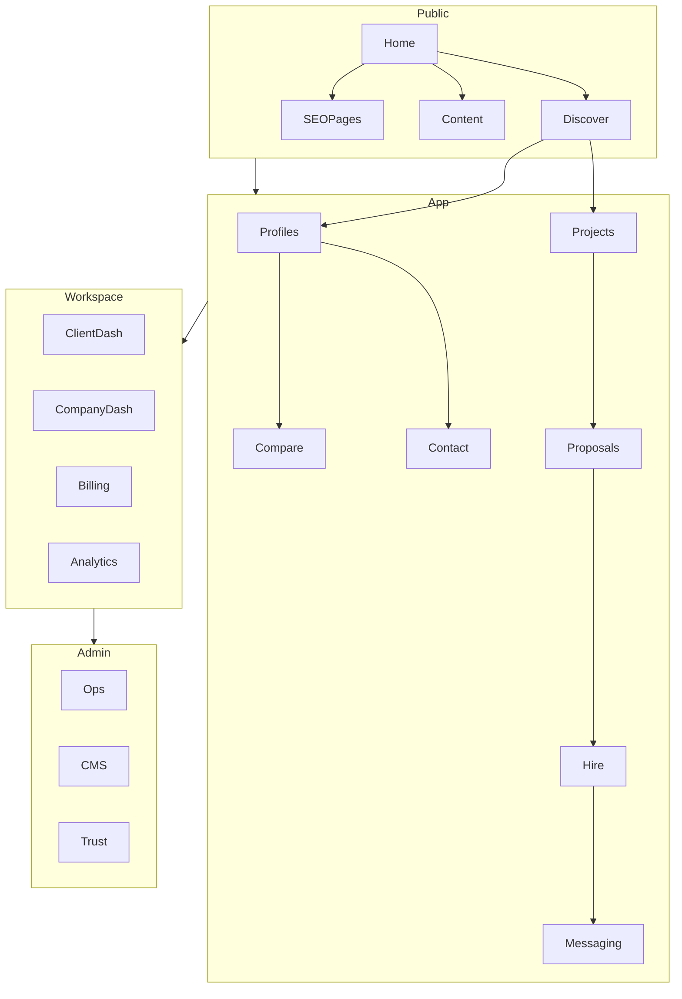
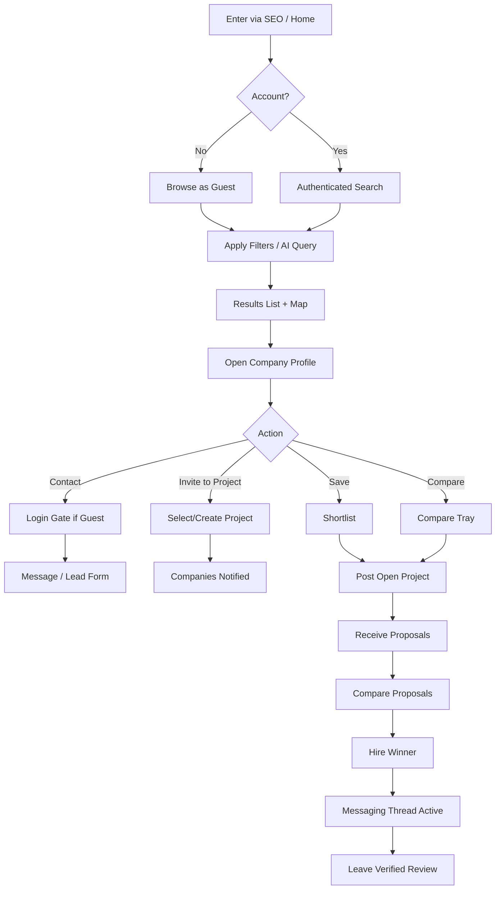
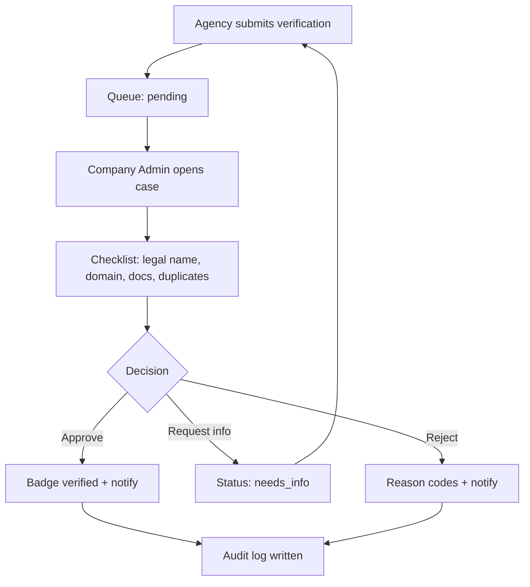
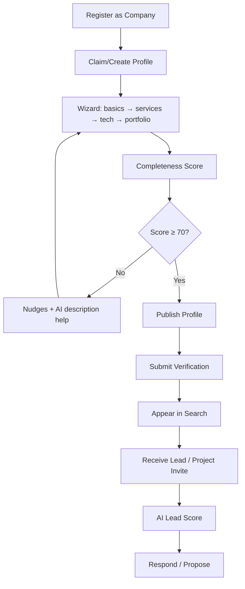
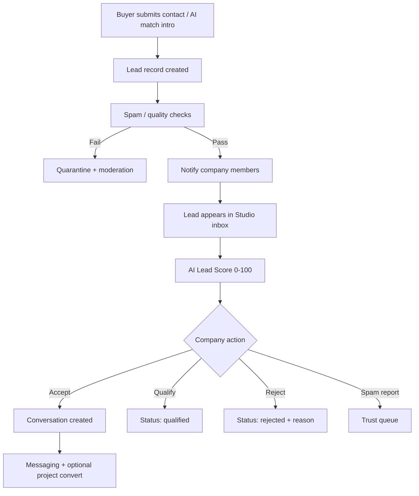
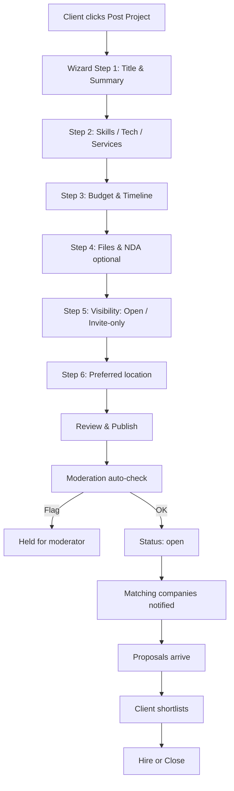
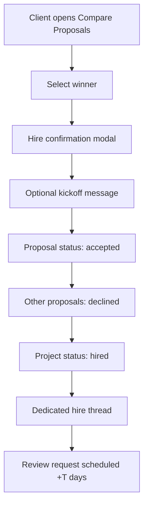
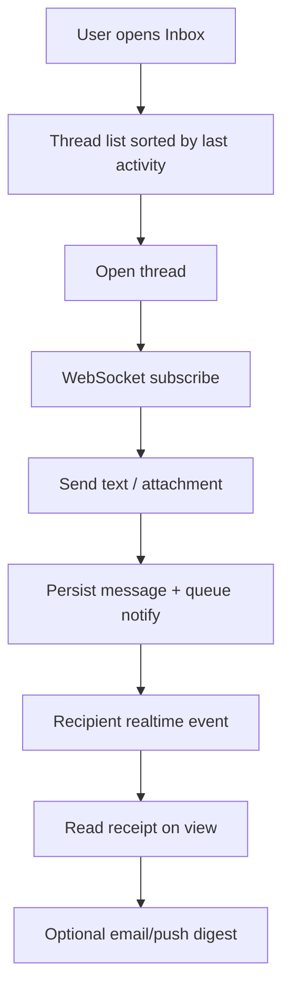

# Phase 3 — Information Architecture, Sitemap & Flows

**Product:** ForgeLink  
**Document:** 03 — Information Architecture  
**Version:** 1.0.0  

---

## 1. Information Architecture Overview

ForgeLink’s IA separates five experience zones:

1. **Public Marketing & SEO** — acquisition & trust
2. **Discovery** — search, directories, comparisons
3. **Marketplace** — projects, proposals, hiring
4. **Workspace** — dashboards for clients & companies
5. **Admin** — operations, CMS, moderation, revenue

---

## 2. Complete Sitemap

### 2.1 Public / Marketing

| Path | Page |
|------|------|
| `/` | Homepage |
| `/about` | About ForgeLink |
| `/how-it-works` | How it works (Buyers / Companies tabs) |
| `/pricing` | Plans & pricing |
| `/pricing/compare` | Plan comparison detail |
| `/contact` | Contact sales / support |
| `/faq` | FAQ hub |
| `/trust` | Trust & verification explained |
| `/ranking` | How ranking works |
| `/blog` | Blog index |
| `/blog/:slug` | Blog article |
| `/resources` | Resource hub |
| `/resources/:slug` | Guide / resource |
| `/legal/terms` | Terms of Service |
| `/legal/privacy` | Privacy Policy |
| `/legal/cookies` | Cookie Policy |
| `/legal/acceptable-use` | Acceptable Use |
| `/legal/review-policy` | Review authenticity policy |
| `/legal/dpa` | Data Processing Addendum |
| `/changelog` | Product changelog |
| `/status` | Public status page link/embed |

### 2.2 Auth

| Path | Page |
|------|------|
| `/login` | Login |
| `/register` | Register (client / company) |
| `/register/company` | Company onboarding start |
| `/auth/forgot-password` | Forgot password |
| `/auth/reset-password` | Reset password |
| `/auth/verify-email` | Email verification |
| `/auth/otp` | OTP challenge |
| `/auth/2fa` | 2FA challenge |
| `/auth/2fa/setup` | 2FA setup |
| `/oauth/callback/:provider` | OAuth callback |

### 2.3 Discovery & Profiles

| Path | Page |
|------|------|
| `/search` | Search results (keyword + filters) |
| `/ai-search` | AI natural language search |
| `/companies` | Browse all companies |
| `/companies/:slug` | Company profile |
| `/companies/:slug/portfolio` | Portfolio gallery |
| `/companies/:slug/portfolio/:itemSlug` | Portfolio item |
| `/companies/:slug/case-studies` | Case studies list |
| `/companies/:slug/case-studies/:caseSlug` | Case study detail |
| `/companies/:slug/reviews` | Reviews tab/page |
| `/companies/:slug/team` | Team / employees |
| `/companies/:slug/locations` | Office locations |
| `/compare` | Compare selected companies |
| `/saved` | Saved companies / searches (auth) |
| `/map` | Map discovery view |

### 2.4 Programmatic SEO Directories

| Path Pattern | Purpose |
|--------------|---------|
| `/directory` | Directory hub |
| `/directory/:country` | Country hub |
| `/directory/:country/:city` | City hub |
| `/services/:serviceSlug` | Service directory |
| `/services/:serviceSlug/:country` | Service × country |
| `/services/:serviceSlug/:country/:city` | Service × city |
| `/technologies/:techSlug` | Technology directory |
| `/technologies/:techSlug/:country` | Tech × country |
| `/industries/:industrySlug` | Industry directory |
| `/industries/:industrySlug/:country` | Industry × country |
| `/hire/:comboSlug` | Curated combo pages (e.g., hire-react-developers-berlin) |
| `/awards/:year` | Awards listing |
| `/verified-companies` | Verified companies index |
| `/top/:segment` | Editorial top lists (QA gated) |

### 2.5 Project Marketplace

| Path | Page |
|------|------|
| `/projects` | Browse open projects (providers) |
| `/projects/new` | Post project wizard |
| `/projects/:id` | Project detail |
| `/projects/:id/edit` | Edit project |
| `/projects/:id/proposals` | Client proposal inbox |
| `/projects/:id/proposals/:proposalId` | Proposal detail |
| `/projects/:id/compare-proposals` | Side-by-side comparison |
| `/projects/:id/hire` | Hire confirmation |
| `/invitations` | Project invitations (company) |

### 2.6 Messaging

| Path | Page |
|------|------|
| `/messages` | Inbox |
| `/messages/:threadId` | Thread view |

### 2.7 Client Workspace

| Path | Page |
|------|------|
| `/app` | Client dashboard |
| `/app/shortlist` | Shortlisted companies |
| `/app/projects` | My projects |
| `/app/reviews` | Reviews to write / written |
| `/app/settings` | Account settings |
| `/app/notifications` | Notification center |
| `/app/security` | Password / 2FA / sessions |

### 2.8 Company Workspace

| Path | Page |
|------|------|
| `/studio` | Company dashboard |
| `/studio/profile` | Edit profile |
| `/studio/media` | Logo, cover, gallery, videos |
| `/studio/portfolio` | Manage portfolio |
| `/studio/case-studies` | Manage case studies |
| `/studio/services` | Services / tech / industries |
| `/studio/team` | Employees |
| `/studio/locations` | Offices |
| `/studio/faqs` | FAQs |
| `/studio/downloads` | Brochures / media kit |
| `/studio/reviews` | Review management & replies |
| `/studio/leads` | Lead inbox |
| `/studio/projects` | Matched / invited projects |
| `/studio/proposals` | Proposal manager |
| `/studio/analytics` | Visibility & conversion analytics |
| `/studio/ai` | AI copilot tools |
| `/studio/verification` | Verification status & upload |
| `/studio/billing` | Plan, payment methods, invoices |
| `/studio/featured` | Featured listing purchases |
| `/studio/team-access` | Members & roles |
| `/studio/settings` | Company settings |
| `/studio/activity` | Activity log |

### 2.9 Admin

| Path | Page |
|------|------|
| `/admin` | Admin dashboard |
| `/admin/users` | User management |
| `/admin/companies` | Company management |
| `/admin/companies/verification` | Verification queue |
| `/admin/projects` | Project moderation |
| `/admin/reviews` | Review moderation |
| `/admin/reports` | Abuse reports |
| `/admin/cms/pages` | CMS pages |
| `/admin/cms/blog` | Blog CMS |
| `/admin/seo` | SEO manager |
| `/admin/seo/redirects` | Redirects |
| `/admin/seo/sitemaps` | Sitemap controls |
| `/admin/taxonomy` | Services, tech, industries, locations |
| `/admin/subscriptions` | Subscriptions |
| `/admin/coupons` | Coupons |
| `/admin/featured` | Featured inventory |
| `/admin/revenue` | Revenue dashboard |
| `/admin/analytics` | Platform analytics |
| `/admin/emails` | Email templates |
| `/admin/notifications` | Notification center |
| `/admin/logs` | Audit / system logs |
| `/admin/reports/export` | Scheduled reports |
| `/admin/settings` | System settings |
| `/admin/feature-flags` | Feature flags |
| `/admin/ai` | AI usage & prompts config |

---

## 3. Navigation Structure

### 3.1 Public Header (Desktop)

| Zone | Items |
|------|-------|
| Left | Logo, Discover ▾, Projects, Pricing, Blog |
| Discover ▾ | Find Companies, AI Search, Services, Technologies, Industries, By Location, Map |
| Right | Log in, Sign up, Post a Project (CTA) |

### 3.2 Public Header (Mobile)

- Hamburger: Discover, Projects, Pricing, How it works, Blog, Trust
- Sticky CTA: Post Project / Sign up
- Bottom bar (app mode): Search, Saved, Messages, Account

### 3.3 Company Studio Nav

Dashboard · Profile · Portfolio · Leads · Projects · Proposals · Reviews · AI · Analytics · Billing · Team · Settings

### 3.4 Client App Nav

Dashboard · Search · Shortlist · Projects · Messages · Reviews · Settings

### 3.5 Admin Nav

Overview · Users · Companies · Trust Queues · Marketplace · CMS · SEO · Commerce · Analytics · System

### 3.6 Footer

| Column | Links |
|--------|-------|
| Product | Search, AI Match, Projects, Pricing, Ranking |
| Directories | Services, Technologies, Countries, Verified |
| Company | About, Careers (Future), Contact, Blog |
| Trust | Verification, Review Policy, Security, Status |
| Legal | Terms, Privacy, Cookies, DPA |
| Social | LinkedIn, X, YouTube, GitHub (community) |

---

## 4. User Flows

### 4.1 User Flow — Buyer Discovery → Hire

**Acceptance**
- Guest can complete search → profile without login
- Login required before contact, message, project post, save (optional soft-gate with local shortlist)
- Hire requires at least one proposal in `submitted` state (or direct hire from invite flow)

### 4.2 Admin Flow — Company Verification

### 4.3 Company Flow — Onboarding → First Lead

### 4.4 Lead Flow

**Lead states:** `new` → `viewed` → `accepted` | `qualified` | `rejected` | `spam` | `converted_to_project` | `archived`

### 4.5 Project Flow

**Project states:** `draft` → `pending_moderation` → `open` → `in_review` → `hired` → `closed` | `cancelled` | `removed`

### 4.6 Hiring Flow

### 4.7 Messaging Flow

**Thread types:** `lead`, `project`, `direct_hire`, `support`

---

## 5. Global UX Patterns

| Pattern | Spec |
|---------|------|
| Compare tray | Persistent bottom tray; max 4 companies |
| Completeness meter | 0–100 with checklist CTAs |
| Empty states | Illustration + primary next action |
| Skeletons | All list/detail async views |
| Toasts | Success/error; no silent failures |
| Permission empty | Explain upgrade / role needed |
| SEO pages | Content block + filtered company grid + FAQs |
| AI actions | Always show “Generated by AI — review before publish” |

---

## 6. URL & Routing Rules

1. Company slugs are unique, immutable after publish (redirects on rare rename)
2. Programmatic SEO pages 404 if taxonomy node unpublished
3. Trailing slash normalized; lowercase paths
4. Canonical tags mandatory on all indexable pages
5. App/Studio/Admin routes are `noindex`
6. Pagination via `?page=` with rel next/prev

---

## 7. IA Acceptance Criteria

- [ ] All sitemap routes documented in page specs (Doc 05)
- [ ] Critical flows covered by analytics events
- [ ] Navigation IA tested for findability (tree test recommended)
- [ ] Programmatic URL patterns implemented as a single routing module
- [ ] Role-based nav variants for Guest / Client / Company / Admin

---

*Next: [04 — Feature Specifications](./04-feature-specifications.md)*
