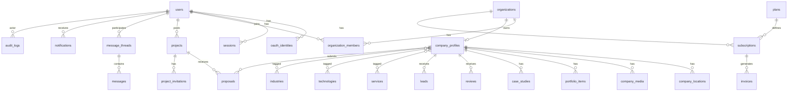

# Database Design

**Product:** ForgeLink  
**Document:** 06 — Database Design  
**Version:** 1.0.0  
**Engine:** PostgreSQL 16+  

---

## 1. Design Principles

1. **UUIDs** as public IDs (`uuid v7` preferred for time-ordering); optional bigserial surrogates internal if needed
2. **Soft deletes** via `deleted_at` on user-facing entities
3. **Timestamps** `created_at`, `updated_at` everywhere
4. **Money** as `bigint` minor units + `currency char(3)`
5. **JSONB** for flexible attributes with GIN indexes where queried
6. **Tenant scope** via `organization_id` for supplier/client orgs
7. **Auditability** for admin/trust actions
8. **Search denormalization** via outbox → Meilisearch indexer

---

## 2. ER Diagram (Core)

---

## 3. Table Specifications

### 3.1 Identity & Access

#### `users`
| Column | Type | Constraints |
|--------|------|-------------|
| id | uuid | PK |
| email | citext | UNIQUE NOT NULL |
| email_verified_at | timestamptz | NULL |
| password_hash | text | NULL (OAuth-only ok) |
| name | varchar(120) | NOT NULL |
| avatar_url | text | NULL |
| phone | varchar(40) | NULL |
| timezone | varchar(64) | DEFAULT 'UTC' |
| locale | varchar(16) | DEFAULT 'en' |
| status | varchar(32) | NOT NULL DEFAULT 'pending_verification' |
| two_factor_secret | text | NULL encrypted |
| two_factor_enabled_at | timestamptz | NULL |
| two_factor_backup_codes_hash | jsonb | NULL |
| last_login_at | timestamptz | NULL |
| deleted_at | timestamptz | NULL |
| created_at | timestamptz | NOT NULL |
| updated_at | timestamptz | NOT NULL |

**Indexes:** `UNIQUE(email)`, `INDEX(status)`, `INDEX(deleted_at)`

#### `oauth_identities`
| Column | Type | Constraints |
|--------|------|-------------|
| id | uuid | PK |
| user_id | uuid | FK users ON DELETE CASCADE |
| provider | varchar(32) | NOT NULL |
| provider_subject | varchar(255) | NOT NULL |
| access_token_enc | text | NULL |
| refresh_token_enc | text | NULL |
| profile_json | jsonb | NULL |
| created_at | timestamptz | NOT NULL |
| updated_at | timestamptz | NOT NULL |

**Indexes:** `UNIQUE(provider, provider_subject)`, `INDEX(user_id)`

#### `sessions` / `refresh_tokens`
| Column | Type | Constraints |
|--------|------|-------------|
| id | uuid | PK |
| user_id | uuid | FK users CASCADE |
| token_hash | char(64) | UNIQUE NOT NULL |
| user_agent | text | NULL |
| ip_inet | inet | NULL |
| expires_at | timestamptz | NOT NULL |
| revoked_at | timestamptz | NULL |
| created_at | timestamptz | NOT NULL |

**Indexes:** `INDEX(user_id)`, `INDEX(expires_at)`

#### `otp_codes`
| Column | Type | Constraints |
|--------|------|-------------|
| id | uuid | PK |
| user_id | uuid | FK NULLABLE |
| email | citext | NOT NULL |
| purpose | varchar(32) | NOT NULL |
| code_hash | char(64) | NOT NULL |
| attempts | int | DEFAULT 0 |
| expires_at | timestamptz | NOT NULL |
| consumed_at | timestamptz | NULL |
| created_at | timestamptz | NOT NULL |

**Indexes:** `INDEX(email, purpose)`, `INDEX(expires_at)`

#### `password_reset_tokens`
| Column | Type | Constraints |
|--------|------|-------------|
| id | uuid | PK |
| user_id | uuid | FK CASCADE |
| token_hash | char(64) | UNIQUE |
| expires_at | timestamptz | NOT NULL |
| used_at | timestamptz | NULL |
| created_at | timestamptz | NOT NULL |

#### `roles` (platform)
| Column | Type | Constraints |
|--------|------|-------------|
| id | uuid | PK |
| key | varchar(64) | UNIQUE NOT NULL |
| name | varchar(120) | NOT NULL |
| description | text | NULL |

#### `permissions`
| Column | Type | Constraints |
|--------|------|-------------|
| id | uuid | PK |
| key | varchar(120) | UNIQUE NOT NULL |
| description | text | NULL |

#### `role_permissions`
| Column | Type | Constraints |
|--------|------|-------------|
| role_id | uuid | FK roles |
| permission_id | uuid | FK permissions |
| PK | (role_id, permission_id) | |

#### `user_platform_roles`
| Column | Type | Constraints |
|--------|------|-------------|
| user_id | uuid | FK users |
| role_id | uuid | FK roles |
| assigned_by | uuid | FK users NULL |
| created_at | timestamptz | NOT NULL |
| PK | (user_id, role_id) | |

---

### 3.2 Organizations & Membership

#### `organizations`
| Column | Type | Constraints |
|--------|------|-------------|
| id | uuid | PK |
| type | varchar(32) | `company` \| `client` |
| name | varchar(160) | NOT NULL |
| status | varchar(32) | DEFAULT 'active' |
| billing_email | citext | NULL |
| created_at | timestamptz | NOT NULL |
| updated_at | timestamptz | NOT NULL |
| deleted_at | timestamptz | NULL |

#### `organization_members`
| Column | Type | Constraints |
|--------|------|-------------|
| id | uuid | PK |
| organization_id | uuid | FK |
| user_id | uuid | FK |
| org_role | varchar(32) | owner/admin/editor/sales/viewer |
| status | varchar(32) | invited/active/revoked |
| invited_email | citext | NULL |
| invited_at | timestamptz | NULL |
| joined_at | timestamptz | NULL |
| created_at | timestamptz | NOT NULL |
| updated_at | timestamptz | NOT NULL |

**Indexes:** `UNIQUE(organization_id, user_id)`, `INDEX(user_id)`

---

### 3.3 Taxonomies

#### `services`, `technologies`, `industries`, `languages`
Shared shape:
| Column | Type | Constraints |
|--------|------|-------------|
| id | uuid | PK |
| parent_id | uuid | FK self NULL |
| name | varchar(160) | NOT NULL |
| slug | varchar(180) | UNIQUE NOT NULL |
| description | text | NULL |
| synonyms | jsonb | DEFAULT [] |
| is_published | boolean | DEFAULT true |
| sort_order | int | DEFAULT 0 |
| seo_title | varchar(70) | NULL |
| seo_description | varchar(180) | NULL |
| created_at / updated_at | timestamptz | |

#### `countries`, `cities`
| countries | iso2 PK/unique, name, slug, is_active |
| cities | id, country_iso2 FK, name, slug, lat, lng, is_active; UNIQUE(country_iso2, slug) |

---

### 3.4 Company Profiles

#### `company_profiles`
| Column | Type | Constraints |
|--------|------|-------------|
| id | uuid | PK |
| organization_id | uuid | UNIQUE FK |
| name | varchar(160) | NOT NULL |
| slug | varchar(180) | UNIQUE NOT NULL |
| tagline | varchar(160) | NULL |
| description | text | NULL |
| logo_path | text | NULL |
| cover_path | text | NULL |
| website | text | NULL |
| founded_year | int | NULL |
| size_band | varchar(32) | NULL |
| hourly_rate_min | bigint | NULL |
| hourly_rate_max | bigint | NULL |
| minimum_budget | bigint | NULL |
| currency | char(3) | DEFAULT 'USD' |
| email_public | citext | NULL |
| phone_public | varchar(40) | NULL |
| social_links | jsonb | DEFAULT {} |
| languages | jsonb | DEFAULT [] |
| completeness_score | numeric(5,2) | DEFAULT 0 |
| company_score | numeric(5,2) | DEFAULT 0 |
| rating_avg | numeric(3,2) | DEFAULT 0 |
| rating_count | int | DEFAULT 0 |
| is_verified | boolean | DEFAULT false |
| verified_at | timestamptz | NULL |
| status | varchar(32) | draft/published/suspended |
| published_at | timestamptz | NULL |
| response_time_hours | numeric(8,2) | NULL |
| meta_title | varchar(70) | NULL |
| meta_description | varchar(180) | NULL |
| deleted_at | timestamptz | NULL |
| created_at / updated_at | timestamptz | |

**Indexes:** `UNIQUE(slug)`, `INDEX(status, is_verified)`, `INDEX(company_score DESC)`, `INDEX(rating_avg DESC)`, `GIN(social_links)` optional, `INDEX(size_band)`, `INDEX(hourly_rate_min, hourly_rate_max)`

#### Pivot tables
- `company_service` (company_id, service_id, is_primary)
- `company_technology` (company_id, technology_id, proficiency NULL)
- `company_industry` (company_id, industry_id)

Each: PK composite + INDEX reverse lookup.

#### `company_locations`
| Column | Type | Constraints |
|--------|------|-------------|
| id | uuid | PK |
| company_id | uuid | FK CASCADE |
| label | varchar(120) | NULL |
| address_line1 | text | NULL |
| address_line2 | text | NULL |
| city_id | uuid | FK cities NULL |
| country_iso2 | char(2) | FK |
| postal_code | varchar(24) | NULL |
| lat | numeric(9,6) | NULL |
| lng | numeric(9,6) | NULL |
| is_hq | boolean | DEFAULT false |
| created_at / updated_at | timestamptz | |

**Indexes:** `INDEX(company_id)`, `INDEX(country_iso2, city_id)`, `INDEX(lat, lng)`

#### `company_media`
| id, company_id, type(logo/cover/gallery/video/download), path, thumb_path, title, alt, caption, sort_order, metadata jsonb, created_at |

#### `employees`
| id, company_id, name, role_title, bio, photo_path, linkedin_url, skills jsonb, is_public, sort_order, created_at, updated_at, deleted_at |

#### `portfolio_items`
| id, company_id, title, slug, summary, description, cover_path, project_url, year, industries jsonb, is_public, sort_order, seo_*, published_at, created_at, updated_at, deleted_at |
**Indexes:** `UNIQUE(company_id, slug)`

#### `portfolio_item_technology` pivot

#### `case_studies`
| id, company_id, title, slug, client_industry, challenge, solution, results jsonb, testimonial, cover_path, is_public, seo_*, published_at, timestamps, deleted_at |

#### `awards`
| id, company_id, title, issuer, year, url, image_path, created_at |

#### `certifications`
| id, company_id, name, issuer, year, credential_url, expires_on, created_at |

#### `company_faqs`
| id, company_id, question, answer, sort_order, created_at, updated_at |

#### `company_verifications`
| id, company_id, status(pending/needs_info/approved/rejected), submitted_by, reviewed_by, documents jsonb, notes, reason_codes jsonb, submitted_at, reviewed_at, created_at, updated_at |

---

### 3.5 Search & Engagement

#### `saved_searches`
| id, user_id, name, query_text, filters jsonb, ai_query, alert_enabled, last_alerted_at, created_at, updated_at |
**Indexes:** `INDEX(user_id)`, `GIN(filters)`

#### `saved_companies`
| user_id, company_id, created_at | PK(user_id, company_id)

#### `comparisons`
| id, user_id NULL, session_id NULL, created_at, updated_at |

#### `comparison_items`
| comparison_id, company_id, sort_order | PK composite

#### `search_query_logs`
| id, user_id NULL, session_id, query, filters jsonb, result_count, source(keyword/ai), created_at |
Retain with TTL / anonymization policy.

---

### 3.6 Leads

#### `leads`
| Column | Type | Constraints |
|--------|------|-------------|
| id | uuid | PK |
| company_id | uuid | FK |
| user_id | uuid | FK NULL |
| source | varchar(32) | profile_form/ai_match/project_invite |
| name | varchar(120) | NOT NULL |
| email | citext | NOT NULL |
| client_company | varchar(160) | NULL |
| budget_min | bigint | NULL |
| budget_max | bigint | NULL |
| currency | char(3) | NULL |
| message | text | NOT NULL |
| attachments | jsonb | DEFAULT [] |
| status | varchar(32) | new/viewed/accepted/... |
| ai_score | numeric(5,2) | NULL |
| ai_score_reasons | jsonb | NULL |
| assigned_to | uuid | FK users NULL |
| thread_id | uuid | FK NULL |
| created_at / updated_at | timestamptz | |

**Indexes:** `INDEX(company_id, status, created_at DESC)`, `INDEX(email)`

---

### 3.7 Projects & Proposals

#### `projects`
| Column | Type | Constraints |
|--------|------|-------------|
| id | uuid | PK |
| client_user_id | uuid | FK |
| client_org_id | uuid | FK NULL |
| title | varchar(160) | NOT NULL |
| slug | varchar(180) | NULL |
| description | text | NOT NULL |
| budget_type | varchar(32) | fixed/hourly/range/undisclosed |
| budget_min | bigint | NULL |
| budget_max | bigint | NULL |
| currency | char(3) | DEFAULT 'USD' |
| timeline_text | varchar(255) | NULL |
| deadline_on | date | NULL |
| visibility | varchar(32) | open/invite/both |
| nda_required | boolean | DEFAULT false |
| nda_type | varchar(32) | platform/custom/null |
| status | varchar(32) | draft/... |
| preferred_countries | jsonb | DEFAULT [] |
| remote_ok | boolean | DEFAULT true |
| hired_proposal_id | uuid | NULL |
| moderated_at | timestamptz | NULL |
| published_at | timestamptz | NULL |
| closed_at | timestamptz | NULL |
| created_at / updated_at / deleted_at | | |

**Indexes:** `INDEX(status, published_at DESC)`, `INDEX(client_user_id)`, `GIN(preferred_countries)`

#### `project_skills` / `project_technologies` / `project_services` pivots

#### `project_files`
| id, project_id, path, filename, mime, size_bytes, scanned_status, created_at |

#### `project_nda_acceptances`
| id, project_id, user_id, organization_id, ip, user_agent, accepted_at |

#### `project_invitations`
| id, project_id, company_id, invited_by, status(pending/accepted/declined), created_at, responded_at |
**Indexes:** `UNIQUE(project_id, company_id)`

#### `proposals`
| Column | Type | Constraints |
|--------|------|-------------|
| id | uuid | PK |
| project_id | uuid | FK |
| company_id | uuid | FK |
| author_user_id | uuid | FK |
| cover_letter | text | NOT NULL |
| approach | text | NULL |
| bid_amount | bigint | NULL |
| bid_type | varchar(32) | NULL |
| currency | char(3) | NULL |
| timeline_text | varchar(255) | NULL |
| milestones | jsonb | DEFAULT [] |
| attachments | jsonb | DEFAULT [] |
| ai_fit_score | numeric(5,2) | NULL |
| status | varchar(32) | draft/submitted/shortlisted/accepted/declined/withdrawn |
| submitted_at | timestamptz | NULL |
| created_at / updated_at | | |

**Indexes:** `UNIQUE(project_id, company_id)`, `INDEX(company_id, status)`, `INDEX(project_id, status)`

---

### 3.8 Messaging

#### `message_threads`
| id, type, subject, project_id NULL, lead_id NULL, company_id NULL, created_by, last_message_at, created_at, updated_at |

#### `message_thread_participants`
| thread_id, user_id, organization_id NULL, last_read_at, muted_at, joined_at | PK(thread_id, user_id)

#### `messages`
| id, thread_id, sender_user_id, body, attachments jsonb, sent_at, edited_at, deleted_at |
**Indexes:** `INDEX(thread_id, sent_at DESC)`

#### `message_receipts`
| message_id, user_id, delivered_at, read_at | PK(message_id, user_id)

---

### 3.9 Reviews

#### `reviews`
| Column | Type | Constraints |
|--------|------|-------------|
| id | uuid | PK |
| company_id | uuid | FK |
| author_user_id | uuid | FK |
| project_id | uuid | FK NULL |
| rating | smallint | CHECK 1–5 |
| rating_quality | smallint | NULL CHECK |
| rating_communication | smallint | NULL |
| rating_deadline | smallint | NULL |
| rating_value | smallint | NULL |
| title | varchar(160) | NULL |
| body | text | NOT NULL |
| is_verified | boolean | DEFAULT false |
| verification_method | varchar(32) | hire/invite/manual |
| status | varchar(32) | pending/published/hidden/removed |
| helpful_count | int | DEFAULT 0 |
| company_reply | text | NULL |
| company_replied_at | timestamptz | NULL |
| ai_topics | jsonb | NULL |
| moderated_by | uuid | NULL |
| created_at / updated_at / deleted_at | | |

**Indexes:** `INDEX(company_id, status, created_at DESC)`, `UNIQUE(author_user_id, company_id, project_id)` where applicable via partial unique

#### `review_votes`
| review_id, user_id, is_helpful, created_at | PK(review_id, user_id)

#### `review_reports`
| id, review_id, reporter_user_id, reason, details, status, created_at, resolved_at |

#### `company_review_summaries`
| company_id PK, summary_text, themes jsonb, generated_at, model_version |

---

### 3.10 Billing

#### `plans`
| id, code UNIQUE, name, interval(month/year), price_amount, currency, features jsonb, limits jsonb, is_active, sort_order, stripe_price_id, razorpay_plan_id, timestamps |

#### `subscriptions`
| id, organization_id, plan_id, status, provider(stripe/razorpay), provider_subscription_id, current_period_start/end, cancel_at_period_end, canceled_at, trial_ends_at, meta jsonb, timestamps |
**Indexes:** `INDEX(organization_id, status)`, `UNIQUE(provider, provider_subscription_id)`

#### `invoices`
| id, organization_id, subscription_id NULL, provider, provider_invoice_id, number, status, amount_due, amount_paid, currency, tax_amount, hosted_url, pdf_path, period_start/end, issued_at, timestamps |

#### `payment_methods`
| id, organization_id, provider, provider_pm_id, brand, last4, exp_month, exp_year, is_default, created_at |

#### `coupons`
| id, code UNIQUE, type(percent/fixed), amount, currency NULL, max_redemptions, redeemed_count, plans_allowed jsonb, starts_at, ends_at, is_active, timestamps |

#### `coupon_redemptions`
| id, coupon_id, organization_id, subscription_id, redeemed_at | UNIQUE(coupon_id, organization_id)

#### `featured_listings`
| id, company_id, placement_key, page_type, target_id NULL, starts_at, ends_at, status, amount, currency, provider_payment_id, created_at |
**Indexes:** `INDEX(placement_key, status, starts_at, ends_at)`

#### `usage_counters`
| organization_id, period_ym, metric_key, used_value | PK(organization_id, period_ym, metric_key)

---

### 3.11 AI

#### `ai_generations`
| id, organization_id NULL, user_id, feature_key, prompt_version, input_json, output_json, tokens_in, tokens_out, cost_millis, status, error, created_at |
**Indexes:** `INDEX(organization_id, created_at DESC)`, `INDEX(feature_key, created_at)`

#### `ai_prompt_templates`
| id, feature_key, version, template, is_active, created_at |

---

### 3.12 CMS / SEO / Content

#### `cms_pages`
| id, slug UNIQUE, title, body, status, seo_*, published_at, timestamps |

#### `blog_posts`
| id, slug UNIQUE, title, excerpt, body, cover_path, author_user_id, status, seo_*, published_at, timestamps |

#### `blog_tags` + `blog_post_tag`

#### `seo_pages`
| id, page_type, country_iso2 NULL, city_id NULL, service_id NULL, technology_id NULL, industry_id NULL, slug_path UNIQUE, title, h1, intro_html, faq_json, status, company_count_cache, noindex, canonical_override, published_at, timestamps |
**Indexes:** unique combination indexes per type; `INDEX(status, page_type)`

#### `redirects`
| id, from_path UNIQUE, to_path, status_code DEFAULT 301, is_active, created_at |

#### `email_templates`
| id, key UNIQUE, subject, body_html, body_text, variables jsonb, updated_at |

---

### 3.13 Notifications & Activity

#### `notifications`
| id, user_id, type, title, body, data jsonb, read_at, created_at |
**Indexes:** `INDEX(user_id, read_at, created_at DESC)`

#### `notification_preferences`
| user_id, channel, event_key, enabled | PK composite

#### `activity_logs`
| id, actor_user_id NULL, organization_id NULL, action, subject_type, subject_id, properties jsonb, ip, created_at |
**Indexes:** `INDEX(organization_id, created_at DESC)`, `INDEX(subject_type, subject_id)`

#### `audit_logs`
| id, actor_user_id, action, severity, subject_type, subject_id, before jsonb, after jsonb, reason, ip, user_agent, created_at |
Append-only; no updates/deletes for app roles.

---

### 3.14 Trust & Moderation

#### `abuse_reports`
| id, reporter_user_id, target_type, target_id, reason, details, status, assigned_to, created_at, resolved_at |

#### `moderation_actions`
| id, report_id NULL, actor_user_id, action, notes, created_at |

---

### 3.15 System

#### `feature_flags`
| key PK, description, enabled, rules jsonb, updated_at |

#### `settings`
| key PK, value jsonb, updated_at |

#### `jobs_outbox`
| id, topic, payload jsonb, status, attempts, available_at, created_at, processed_at |
For reliable search index / email / AI fanout.

#### `file_objects`
| id, disk, path, mime, size_bytes, checksum, uploaded_by, scan_status, created_at |

---

## 4. Relationship Summary

| Parent | Child | Rel | On Delete |
|--------|-------|-----|-----------|
| users | organization_members | 1:N | CASCADE |
| organizations | company_profiles | 1:1 | CASCADE |
| company_profiles | portfolio_items | 1:N | CASCADE |
| company_profiles | reviews | 1:N | CASCADE |
| users | projects | 1:N | RESTRICT |
| projects | proposals | 1:N | CASCADE |
| company_profiles | proposals | 1:N | CASCADE |
| plans | subscriptions | 1:N | RESTRICT |
| organizations | subscriptions | 1:N | CASCADE |
| message_threads | messages | 1:N | CASCADE |

---

## 5. Critical Indexes & Constraints Checklist

- [ ] Unique company slug / email / OAuth subject
- [ ] Partial unique: one active subscription per org (`WHERE status IN ('active','trialing')`)
- [ ] CHECK constraints on ratings 1–5
- [ ] CHECK hourly_rate_max >= hourly_rate_min
- [ ] FK indexes on all FK columns
- [ ] GIN on JSONB filter fields used in admin search
- [ ] BRIN/created_at on high-volume logs if partitioned
- [ ] Table partitioning plan for `search_query_logs`, `notifications`, `audit_logs`, `ai_generations`, `messages` (by month) at scale

---

## 6. Data Retention & GDPR

| Data | Retention |
|------|-----------|
| Message content | Active + 3 years after thread close (configurable) |
| Search logs | 90 days then aggregate |
| Audit logs | 7 years |
| Soft-deleted users | 30-day purge job after delete request |
| Invoices | 7+ years (legal) |
| AI generations | 1 year (or per policy) |

GDPR flows: export job assembles user+owned content JSON; delete job anonymizes/removes per matrix.

---

## 7. Meilisearch Documents (Derived)

**Index `companies`** fields: id, name, slug, tagline, description, services[], technologies[], industries[], countries[], cities[], size_band, rates, rating_avg, rating_count, is_verified, is_featured, company_score, completeness_score, languages[], geo(_geo), updated_at  

**Index `projects`** (provider search): id, title, description, skills, budget, countries, status, published_at  

Sync via outbox + workers; never dual-write without eventual consistency handler.

---

*Next: [07 — API Documentation](./07-api-documentation.md)*
