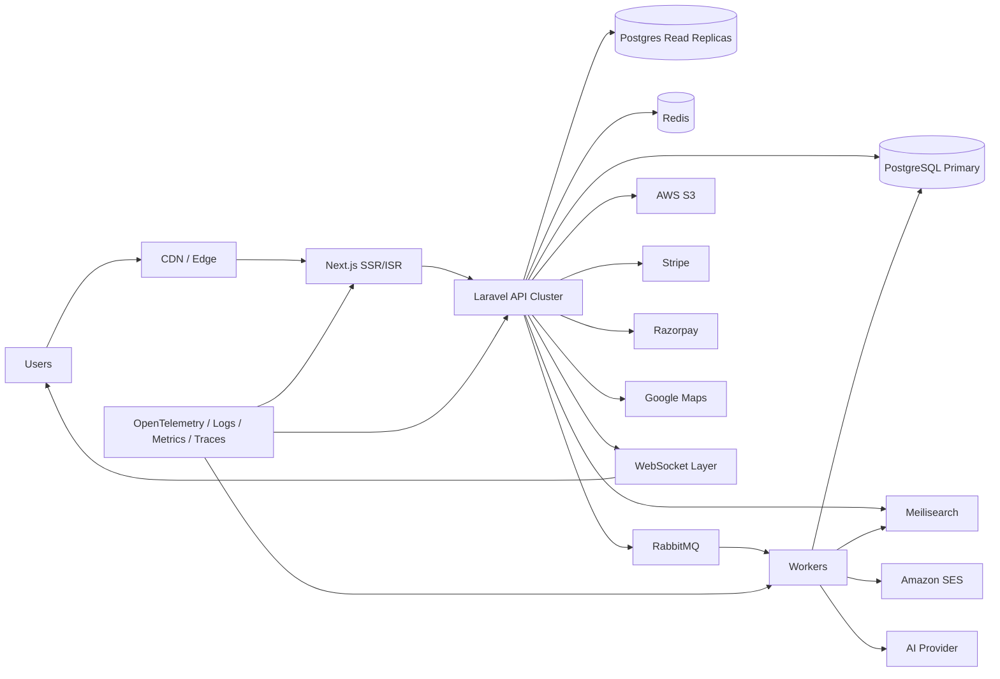
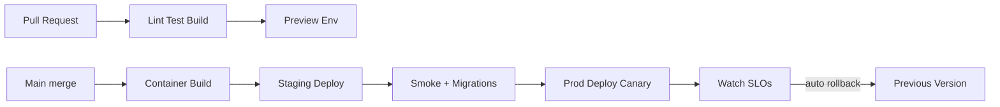

# System Architecture, Security & Performance

**Product:** ForgeLink  
**Document:** 08 — Architecture · Security · Performance · Stack · CI/CD  
**Version:** 1.0.0  

---

## 1. System Architecture Overview

### Architecture Style
- **Modular monolith API** (Laravel) for MVP speed + clear domain modules
- **Horizontally scalable** stateless API pods
- **Async side-effects** via RabbitMQ workers (email, indexing, AI, webhooks fanout)
- **CQRS-lite** for search (Postgres source of truth → Meilisearch projections)
- **SSR/ISR frontend** for SEO pages; client-heavy app shells for Studio/Admin

---

## 2. Recommended Tech Stack

| Layer | Choice | Notes |
|-------|--------|-------|
| Frontend | **Next.js** (App Router) + **React** + **TypeScript** + **TailwindCSS** | SSR/ISR/SSG mix |
| UI kit | Headless components (Radix) + design tokens | Accessible |
| Backend | **Laravel 12** + **PHP 8.4** | Modular domains |
| API auth | **JWT** + refresh + **OAuth** (Google, LinkedIn) | Sanctum/Passport-style custom JWT OK |
| Database | **PostgreSQL 16** | Primary + replicas |
| Cache | **Redis** | Cache, rate limit, sessions/locks |
| Search | **Meilisearch** | Typo-tolerant keyword; vectors via plugin/secondary later |
| Queue | **RabbitMQ** | Durable queues; DLQ |
| Storage | **AWS S3** | Media/docs; lifecycle rules |
| CDN | CloudFront / Cloudflare | Assets + edge cache HTML where safe |
| Email | **Amazon SES** | Templates + events |
| Payments | **Stripe** + **Razorpay** | Dual provider |
| Maps | **Google Maps** | Places + Maps JS |
| Realtime | Laravel Reverb / Soketi (WS) | Sticky sessions or Redis adapter |
| AI | Provider-abstracted (OpenAI-compatible) | Prompt registry |
| Monitoring | OpenTelemetry + Prometheus/Grafana + Sentry | |
| Logging | Structured JSON → OpenSearch/ELK or CloudWatch | |
| CI/CD | GitHub Actions → container registry → K8s/ECS | |

---

## 3. Frontend Architecture

### Rendering Strategy

| Page Type | Mode |
|-----------|------|
| Marketing, blog, legal | SSG/ISR |
| Programmatic SEO | ISR with on-demand revalidation |
| Company profiles | ISR + tag revalidate on update |
| Search results | SSR/CSR hybrid |
| Studio / App / Admin | CSR behind auth (noindex) |
| Messaging | CSR + WS |

### FE Structure
- `apps/web` Next.js
- Feature folders: `search`, `profile`, `projects`, `studio`, `admin`, `ai`
- Shared UI package
- Typed API client from OpenAPI
- React Query / TanStack Query for client state
- Zod for form validation aligning with API

### FE Performance Budgets
- JS hydrated bundle (initial) ≤ 200KB gzip critical path
- Images: next/image, AVIF/WEBP, responsive srcset
- Fonts: self-host 1–2 expressive families; font-display swap
- Code splitting per route

---

## 4. Backend Architecture

### Domain Modules (Laravel)
`Auth`, `Users`, `Organizations`, `Companies`, `Taxonomies`, `Search`, `Leads`, `Projects`, `Proposals`, `Messaging`, `Reviews`, `Billing`, `AI`, `CMS`, `SEO`, `Admin`, `Files`, `Notifications`, `Trust`

### API Cluster
- Stateless PHP-FPM / Octane (RoadRunner/Swoole) evaluation after MVP
- Horizontal autoscaling on CPU/RPS
- Read replica routing for heavy GET lists

### Workers
| Queue | Jobs |
|-------|------|
| `default` | general |
| `mail` | SES sends |
| `search` | Meilisearch upsert/delete |
| `ai` | generations, scoring, summaries |
| `webhooks` | payment reconciliation |
| `exports` | GDPR/report CSVs |
| `moderation` | AV scan, toxicity precheck |

Dead-letter queues + retry policies mandatory.

---

## 5. Database Architecture

- Primary writer in primary region
- Async replicas for read scaling
- Connection pooling (PgBouncer)
- Migrations via CI; expand/contract pattern for zero-downtime
- Partition high-volume tables as scale demands (Doc 06)
- Nightly ANALYZE / index health checks
- Point-in-time recovery enabled

---

## 6. Caching Strategy

| Cache | TTL | Examples |
|-------|-----|----------|
| Edge CDN | 60s–24h | SSG/ISR HTML, images |
| Redis object | 30s–15m | plan catalog, taxonomies, SEO page payloads |
| Redis aside | short | hot company profiles |
| HTTP cache headers | vary auth | public GETs |
| Meilisearch | N/A | search source |
| Negative cache | 30s | 404 slugs |

**Invalidation:** domain events → cache tags / Next revalidate API / search outbox  

**Never cache:** personalized dashboards, messages, billing, admin.

---

## 7. Search Engine Design

1. Company update → outbox row  
2. Worker builds denormalized document  
3. Upsert Meilisearch  
4. AI search: NL → filter inference + optional embedding ANN (P2 vector index) + Meilisearch hybrid  

Synonyms & ranking rules managed in config; featured slots applied at query blend layer with disclosure.

---

## 8. Storage & CDN

- S3 buckets: `public-media`, `private-docs`, `invoices`
- Presigned uploads; private docs never public-ACL
- Image transforms via imgproxy/CloudFront functions
- Lifecycle: incomplete uploads abort; quarantined infected deleted
- CDN cache for public media

---

## 9. Messaging / Realtime

- WS gateway authenticates JWT
- Presence optional
- Fanout via Redis pub/sub
- Persist first, then emit (avoid ghost messages)
- Attachment size limits + AV scan before downloadable

---

## 10. Monitoring & Logging

| Signal | Tooling |
|--------|---------|
| Metrics | RPS, latency p50/p95/p99, queue lag, error rate, saturation |
| Traces | OtEL across FE (sample), API, workers |
| Logs | JSON structured; correlation `request_id` |
| Errors | Sentry (FE+BE) |
| Uptime | External probes on `/health` `/ready` |
| Product analytics | Privacy-aware event pipeline |

**SLOs:** API availability 99.9%; p95 API < 300ms (non-AI); AI p95 < 8s.

---

## 11. CI/CD

**Pipeline checks**
- PHPStan / Pint / PHPUnit / Feature tests
- ESLint / tsc / Playwright smoke
- Dependency scanning + container scan
- Migration dry-run
- OpenAPI drift check

**Environments:** local · preview · staging · production  
**Secrets:** cloud secret manager; never in git  

---

## 12. Security

### 12.1 RBAC & Permissions
- Deny-by-default policies
- Platform roles + org roles (Doc 02)
- Permission keys enforced in Form Requests / Policies
- Admin 2FA mandatory

### 12.2 JWT & Sessions
- Short-lived access tokens
- Rotating refresh tokens hashed at rest
- Audience/issuer validation
- Session revoke on password reset / suspension

### 12.3 Rate Limiting
- Redis token buckets per IP/user/endpoint class
- Stricter on auth, AI, leads, messaging

### 12.4 CSRF
- Cookie-based session mode uses CSRF tokens
- Pure Bearer API exempt but CORS locked to known origins

### 12.5 XSS
- Output encoding in FE
- CSP headers
- Sanitize rich text (HTML allowlist server-side)

### 12.6 SQL Injection
- Eloquent/Query Builder parameterized only
- No raw SQL without bindings + review

### 12.7 Encryption
- TLS 1.2+ everywhere
- Secrets encrypted (KMS)
- Sensitive columns (2FA secret, OAuth tokens) encrypted at rest
- S3 SSE

### 12.8 Backups
- Postgres PITR + daily snapshots
- Encrypted backups
- Quarterly restore drills
- S3 versioning on critical buckets

### 12.9 Audit Logs
- Immutable audit for admin/trust/billing overrides
- Security activity for logins/2FA

### 12.10 GDPR / Privacy
- Cookie consent + preference center
- DSR export/delete pipelines
- Data retention jobs
- DPA for enterprise
- Privacy by design in AI prompts (minimize PII)
- Regional data considerations documented for Phase 2

### 12.11 Additional Controls
- CAPTCHA on public forms
- AV scanning uploads
- Security headers (HSTS, X-Content-Type-Options, Frame-Ancestors)
- Dependency SBOM
- Pen test before public GA
- WAF at edge
- Least-privilege IAM roles for workers

---

## 13. Performance

### 13.1 Application
- Eager-load prevention of N+1 (detect in CI)
- Pagination mandatory on lists
- Lazy load images/below-fold sections
- SSR/ISR for SEO; stream where beneficial
- Code splitting & dynamic imports
- Debounce autocomplete
- Virtualize long admin tables

### 13.2 Data
- Composite indexes for primary query paths (Doc 06)
- Materialized counters on company (`rating_avg`, `rating_count`)
- Counter caches / Redis for hot metrics
- Avoid unbounded JSON scans in request path

### 13.3 Async Offload
- AI, email, indexing, thumbnails, sitemaps, analytics rollups → queues
- Background workers autoscale on queue depth

### 13.4 Image Optimization
- Upload max bounds
- Generate derivatives (sm/md/lg/webp)
- CDN cache forever + fingerprint paths

### 13.5 Load Targets (Steady Design Goal)

| Scenario | Target |
|----------|--------|
| Search QPS | 500+ |
| Profile RPS | 1000+ (CDN/ISR assisted) |
| Concurrent WS users | 50k+ (phased) |
| Worker throughput | AI burst isolation so core queues healthy |

Capacity testing required before GA marketing spikes.

---

## 14. Multi-Region & Scale Path

| Stage | Topology |
|-------|----------|
| MVP | Single primary region (e.g., `eu-central-1` or `us-east-1`) |
| Growth | Read replicas + CDN global |
| Scale | Active-passive failover; region-aware media |
| Future | Active-active with careful write routing; regional data residency packs |

---

## 15. Dependency Map

| Dependency | Failure Mode | Mitigation |
|------------|--------------|------------|
| Meilisearch | Search degrade | Postgres fallback simple search |
| Redis | Cache miss storm | Serve without cache; protect DB |
| RabbitMQ | Async delay | Durable disks; alert lag; publish outbox |
| SES | Email delay | Retry + secondary provider optional |
| AI provider | 502/timeout | Circuit breaker; queue retry; graceful message |
| Stripe/Razorpay | Checkout down | Status banner; retry webhooks |
| S3 | Upload fail | User-visible error; resume presign |

---

## 16. Health Endpoints

- `GET /health` — process up
- `GET /ready` — PG + Redis + MQ connectivity
- Worker heartbeat metrics

---

## 17. Architecture Acceptance Criteria

- [ ] Stateless API deployable in ≥2 replicas
- [ ] All SEO pages render without client auth
- [ ] Search eventually consistent ≤ 60s after profile publish
- [ ] Payments entitlements reconcile via webhooks only
- [ ] Observability dashboards live before GA
- [ ] Security checklist signed off (section 12)
- [ ] Performance budgets measured in staging under load

---

*Next: [09 — Roadmap & Sprint Planning](./09-roadmap-sprints.md)*
