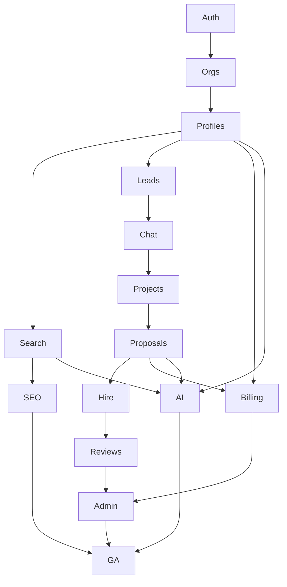

# Development Roadmap & Sprint Planning

**Product:** ForgeLink  
**Document:** 09 — Roadmap · Milestones · Sprints · Prioritization  
**Version:** 1.0.0  

> Timelines below are **engineering effort bands** expressed in sprint cadence, not calendar promises. Adjust capacity to team size. Default assumption: **2-week sprints**, cross-functional squad (FE, BE, Design, QA, DevOps part-time).

---

## 1. Delivery Phases Overview

| Phase | Goal |
|-------|------|
| **MVP** | Liquid discovery + contact + projects + messaging + reviews + paid plans + core AI + SEO foundations |
| **Phase 2** | Deeper AI, i18n, freelancer mode, advanced analytics, lead boosts, escrow evaluation |
| **Future** | Native apps, enterprise SSO/API ecosystem, milestone payments, talent/jobs |

---

## 2. Milestones (MVP)

### Milestone M0 — Foundations
**Objectives:** Repo, environments, CI/CD, design system skeleton, observability baseline  
**Features:** Monorepo/apps bootstrap; Postgres/Redis/RabbitMQ/Meilisearch/S3 local+staging; auth middleware skeleton; health endpoints; lint/test pipelines  
**Dependencies:** Cloud accounts, domains, secrets  
**Deliverables:** Deployable empty FE+API to staging; ADR log started  
**Effort band:** 1 sprint  

### Milestone M1 — Identity & Organizations
**Objectives:** Users can register/login securely; orgs & roles exist  
**Features:** Email login, Google/LinkedIn OAuth, OTP, 2FA, forgot password, profiles, org memberships, RBAC policies, activity/security logs  
**Dependencies:** M0; OAuth apps; SES  
**Deliverables:** Auth E2E tests; permission matrix enforced on sample routes  
**Effort band:** 2 sprints  

### Milestone M2 — Company Profiles
**Objectives:** Companies can publish rich profiles  
**Features:** Profile fields, media uploads, portfolio, case studies, team, locations/maps, taxonomies, FAQs, downloads, completeness score, public profile page  
**Dependencies:** M1; S3; Google Maps key  
**Deliverables:** Profile publish flow; Studio editors  
**Effort band:** 2–3 sprints  

### Milestone M3 — Search, Directories & SEO
**Objectives:** Buyers discover companies via search & SEO pages  
**Features:** Meilisearch sync, keyword search, autocomplete, filters, sorting, saved searches, map view, programmatic SEO routes, schema, sitemap, robots, breadcrumbs, canonicals, OG/Twitter  
**Dependencies:** M2; taxonomy seed data  
**Deliverables:** Search SLA met in staging; sample country/service pages live  
**Effort band:** 2–3 sprints  

### Milestone M4 — Leads & Messaging
**Objectives:** Buyers contact companies; realtime conversation  
**Features:** Lead form, lead inbox, spam checks, threads, attachments, typing, read receipts, notifications  
**Dependencies:** M2; WS infra  
**Deliverables:** Lead→thread conversion; email notifications  
**Effort band:** 2 sprints  

### Milestone M5 — Project Marketplace & Hiring
**Objectives:** Full post→propose→hire path  
**Features:** Project wizard, files, NDA, invitations, open marketplace browse, proposals, compare, hire workflow, project statuses, moderation hooks  
**Dependencies:** M4  
**Deliverables:** Hire E2E; proposal limits by plan stub  
**Effort band:** 2–3 sprints  

### Milestone M6 — Reviews & Trust
**Objectives:** Verified social proof + ops queues  
**Features:** Review submit, dimensions, helpful votes, report abuse, company replies, moderation queue, verification queue, explainable company score v1, AI review summary v1  
**Dependencies:** M5 (for verified-via-hire); M2  
**Deliverables:** Trust policies published; moderator tooling  
**Effort band:** 2 sprints  

### Milestone M7 — Subscriptions & Commerce
**Objectives:** Monetize visibility & limits  
**Features:** Plans Free–Enterprise, Stripe+Razorpay checkout, webhooks, invoices, coupons, usage meters, featured listings, billing portal, upgrade CTAs  
**Dependencies:** M2–M5 entitlements wiring; tax config  
**Deliverables:** Paid plan purchase in staging+prod test mode; entitlement enforcement  
**Effort band:** 2 sprints  

### Milestone M8 — AI Layer (MVP scope)
**Objectives:** AI differentiators live with guardrails  
**Features:** AI smart search, company matching, description generator, FAQ generator, SEO meta generator, proposal writer, lead scoring (Pro+), credits metering, generation audit  
**Dependencies:** M3–M7; AI vendor; prompt templates  
**Deliverables:** Human-approval publish path; cost dashboards  
**Effort band:** 2 sprints  

### Milestone M9 — Admin, Hardening, GA Readiness
**Objectives:** Operate the marketplace safely at launch  
**Features:** Admin dashboard, user/company mgmt, CMS/blog, SEO manager, email templates, revenue views, feature flags, GDPR export/delete, pen-test fixes, load test, CWV pass, legal pages  
**Dependencies:** All prior  
**Deliverables:** GA checklist signed; runbooks; on-call rota  
**Effort band:** 2 sprints  

---

## 3. Sprint Planning (Until Production Release)

Assumption: **Sprint = 2 weeks**. MVP ≈ **18–20 sprints** wall-to-wall for a single squad; parallel squads can compress.

### Sprint 1 — Platform Skeleton
- Repo, Docker compose, CI, staging deploy
- Design tokens + layout shell
- DB migrations framework + users table stub  
**Exit:** Hello-world FE/API on staging with health checks  

### Sprint 2 — Auth Core
- Register/login/logout/refresh
- Email verification + forgot/reset
- SES integration  
**Exit:** Email auth E2E green  

### Sprint 3 — OAuth + OTP + 2FA
- Google + LinkedIn
- OTP flows
- TOTP 2FA + backup codes  
**Exit:** MFA challenge path works  

### Sprint 4 — Organizations & RBAC
- Org create, invites, roles
- Policies middleware
- Security activity log  
**Exit:** Permission tests for client vs agency_owner  

### Sprint 5 — Company Profile v1
- Core fields, slug, publish/draft
- Logo/cover upload presign
- Public profile page SSR  
**Exit:** Published profile viewable  

### Sprint 6 — Profile Depth
- Portfolio + case studies CRUD
- Services/tech/industries attach
- Completeness score  
**Exit:** Completeness ≥ checklist computed  

### Sprint 7 — Locations, Team, FAQs, Media
- Offices + Maps
- Employees
- Gallery/videos/downloads
- FAQ editor  
**Exit:** Profile sections complete for MVP  

### Sprint 8 — Search Indexing
- Outbox + Meilisearch worker
- Keyword search API
- Autocomplete  
**Exit:** Indexed companies searchable <60s  

### Sprint 9 — Filters, Sort, Saved Searches, Map
- All MVP filters
- Facets
- Saved searches + alerts job
- Map browse  
**Exit:** Search UX feature-complete  

### Sprint 10 — Programmatic SEO
- SEO page model + generators
- Directory templates
- Schema, breadcrumbs, sitemap, robots
- On-demand revalidation  
**Exit:** Sample SEO pages score well in Lighthouse SEO  

### Sprint 11 — Leads
- Public lead form + CAPTCHA
- Studio lead inbox
- Status transitions + notifications  
**Exit:** Lead created→notified→viewed  

### Sprint 12 — Messaging
- Threads/messages REST
- WebSocket typing/read
- Attachments + AV scan  
**Exit:** Two users chat realtime in staging  

### Sprint 13 — Projects v1
- Project wizard + files + NDA
- Publish + moderation auto-check
- Invite-only + open visibility  
**Exit:** Project appears in marketplace  

### Sprint 14 — Proposals & Hire
- Submit/withdraw proposal
- Compare UI
- Hire workflow + decline others
- Thread linkage  
**Exit:** End-to-end hire demo  

### Sprint 15 — Reviews & Verification
- Review create/vote/report/reply
- Verification submission + admin queue
- Company score v1  
**Exit:** Verified badge grants after approve  

### Sprint 16 — Billing
- Plans + Stripe checkout/webhooks
- Razorpay path
- Invoices + coupons
- Usage counters enforcement  
**Exit:** Upgrade unlocks proposal/AI limits  

### Sprint 17 — Featured + Studio Analytics
- Featured listing purchase/slots
- Analytics dashboard v1
- Ranking explanation UI  
**Exit:** Featured slot renders with label  

### Sprint 18 — AI MVP
- Smart search + match
- Description/FAQ/SEO meta generators
- Proposal writer
- Credits ledger  
**Exit:** AI outputs require approve-to-publish  

### Sprint 19 — Admin CMS/SEO/Ops
- Admin dashboards & queues polish
- CMS/blog
- Email templates
- Feature flags  
**Exit:** Ops can run without DB access  

### Sprint 20 — Hardening & GA
- GDPR export/delete
- Load test + CWV fixes
- Security review remediation
- Content seed (taxonomies, legal)
- Production launch checklist  
**Exit:** **MVP Production Release**  

---

## 4. Post-GA — Phase 2 Roadmap

### Objectives
Increase match quality, expand supply types, internationalize, deepen monetization & AI.

### Features
| Feature | Notes |
|---------|-------|
| AI Blog Writer | Human editorial workflow |
| Advanced AI review analysis | Themes for Pro+ |
| Response-time & timezone filters | |
| Freelancer profiles | Lightweight provider type |
| i18n UI | ES, DE, FR, PT, AR |
| Hreflang | SEO |
| Web push notifications | |
| Lead boosts / promoted replies | New revenue |
| Advanced analytics export | CSV/BI |
| Message search | |
| Duplicate company merge tooling | Trust |
| A/B ranking experiments | |
| Escrow / milestone payments evaluation | Build-or-partner decision |
| SMS OTP | |
| SSO (SAML/OIDC) for Enterprise | |
| Public read API for Pro+ | |

**Dependencies:** Stable MVP metrics; support staffing; localization vendor  
**Effort band:** ~8–12 sprints (parallelizable)  
**Deliverables:** Phase 2 launch notes; localization QA; enterprise SSO pilot  

---

## 5. Future Enhancements

| Theme | Items |
|-------|-------|
| Mobile | iOS/Android apps |
| Commerce | Full escrow, dispute resolution, multi-currency payouts |
| Talent | Jobs/careers module for company hiring individuals |
| Graph | Skills ontology + deeper knowledge graph matching |
| Trust | Background checks partnerships; SOC2 marketing site |
| Ecosystem | Embeddable hire widgets; partner affiliate program |
| Data | Buyer intent datasets (privacy-safe) for Enterprise |
| Community | Forums / AMA with verified agencies |
| Media | Built-in video intro recording |
| Automation | Zapier/Make webhooks |

---

## 6. Prioritized Backlog Summary

### 6.1 MVP (Must Ship)

**P0 — Launch blockers**
- [ ] Auth (email, Google, LinkedIn, OTP, 2FA, reset)
- [ ] Company profiles + Studio editors
- [ ] Search + filters + autocomplete
- [ ] Public profile SEO pages
- [ ] Leads + messaging
- [ ] Projects + proposals + hire
- [ ] Reviews + moderation + verification
- [ ] Plans + Stripe/Razorpay + entitlements
- [ ] Admin ops queues + CMS basics
- [ ] AI smart search + description generator + matching
- [ ] Sitemaps/schema/CWV/GDPR basics
- [ ] Monitoring/alerting/backups

**P1 — MVP strong**
- [ ] Saved searches + compare
- [ ] Featured listings
- [ ] AI proposal writer, FAQ/SEO meta, lead scoring
- [ ] Ranking explanation page
- [ ] Map discovery
- [ ] Coupons + invoices PDF

### 6.2 Phase 2

- [ ] Freelancers
- [ ] i18n + hreflang
- [ ] AI blog writer + deeper analytics
- [ ] Lead boosts
- [ ] SSO enterprise
- [ ] Escrow decision + pilot
- [ ] Web push / SMS OTP

### 6.3 Future

- [ ] Native apps
- [ ] Jobs module
- [ ] Full marketplace payments
- [ ] Partner API ecosystem
- [ ] Advanced graph matching

---

## 7. Team Topology Recommendation

| Squad | Ownership |
|-------|-----------|
| Discovery | Search, SEO pages, profiles public |
| Marketplace | Projects, proposals, hire, messaging |
| Growth & AI | AI features, analytics, ranking |
| Commerce & Trust | Billing, verification, reviews, abuse |
| Platform | CI/CD, observability, performance, security |

Single-squad sequential delivery follows the sprint plan above; multi-squad can parallelize Discovery ∥ Marketplace after M1.

---

## 8. Dependency Graph (Critical Path)

---

## 9. Launch Checklist (Production)

### Product
- [ ] Legal pages published & counsel-approved
- [ ] Ranking & review policies public
- [ ] Pricing finalized
- [ ] Support macros ready

### Engineering
- [ ] Prod envs + secrets
- [ ] Migrations applied
- [ ] Webhooks configured (Stripe/Razorpay/SES)
- [ ] Backups verified restore
- [ ] Rate limits tuned
- [ ] Feature flags default safe

### SEO
- [ ] robots allow prod
- [ ] sitemap submitted
- [ ] Search Console + Analytics connected
- [ ] CWV p75 within budget on templates

### Trust
- [ ] Moderator playbooks
- [ ] Verification checklist
- [ ] Abuse escalation path

### Success Instrumentation
- [ ] North star dashboard live
- [ ] Funnel events validated
- [ ] Alerting on SLO burn

---

## 10. Risks to Schedule

| Risk | Mitigation |
|------|------------|
| AI cost overruns | Hard credit caps; cache embeddings; smaller models for classification |
| Search relevance tuning | Early golden-set eval harness |
| Payment webhook edge cases | Idempotency + reconciler job |
| SEO thin pages | Threshold gates; human QA for head terms |
| Realtime complexity | Ship polling fallback behind flag |

---

## 11. Definition of Production Ready

MVP is done when Doc 01 §11 gate is satisfied **and**:
- [ ] All P0 checklist items complete
- [ ] No open Sev-1 bugs
- [ ] Load test report accepted
- [ ] Security review accepted
- [ ] On-call + runbooks published
- [ ] Seeded taxonomies + ≥ initial company corpus strategy executed

---

## 12. Document Control

This roadmap is the execution companion to:
- Strategy → Doc 01  
- Permissions → Doc 02  
- IA/Flows → Doc 03  
- Features → Doc 04  
- Pages → Doc 05  
- DB → Doc 06  
- API → Doc 07  
- Architecture → Doc 08  

**Change process:** Any scope change impacting P0 requires Product + Architecture approval and sprint plan update.

---

# End of ForgeLink PRD v1.0.0

Developers should be able to implement ForgeLink from Documents 01–09 without additional product discovery questions. Remaining clarifications (brand visual identity, exact legal copy, final price points, AI vendor selection) are **configuration decisions**, not product definition gaps.
